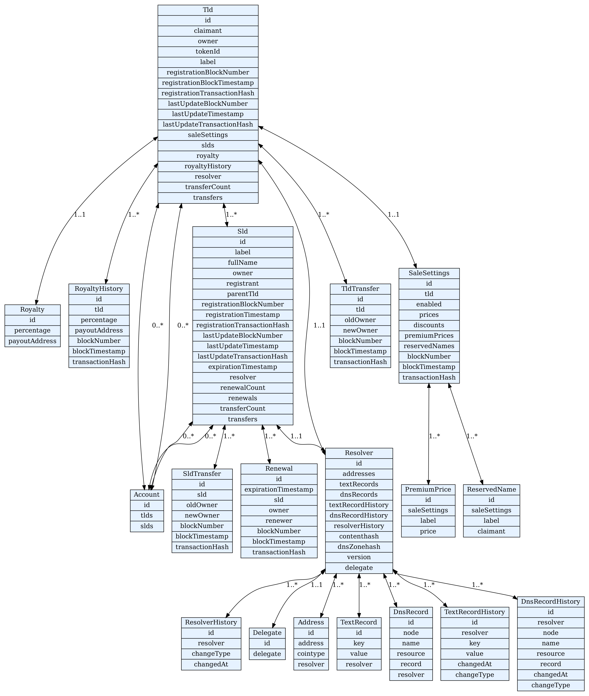

# HNS.ID Subgraph

## Overview

This Subgraph sources events from the HNS.ID contracts, including the registration managers and any resolvers linked to domains. The resolvers are added through dynamic data sources.

For more information on the underlying technology, consult [The Graph Documentation](https://thegraph.com/docs/developer/quick-start/).

### Entities Diagram



## Table of Contents
1. [Example Query](#example-query)
2. [Installing and Running Graph Node Locally with Docker](#installing-and-running-graph-node-locally-with-docker)
3. [Clearing Postgres Data](#clearing-postgres-data)
4. [Deploying Subgraphs](#deploying-subgraphs)
5. [Deployment to Hosted Service](#deployment-to-hosted-service)


# Example Query
```graphql
{
  tlds {
    id
    claimant {
      id
    }
    owner {
      id
      tlds {
        id
      }
      slds {
        id
      }
    }
    tokenId
    label
    registrationBlockNumber
    registrationBlockTimestamp
    lastUpdateBlockNumber
    lastUpdateTimestamp
    transferCount
    saleSettings {
      id
      enabled
      prices
      discounts
      blockNumber
      blockTimestamp
      premiumPrices {
        id
        label
        price
      }
      reservedNames {
        id
        label
        claimant
      }
    }
    slds {
      id
      label
      fullName
      owner {
        id
      }
      registrant {
        id
      }
      registrationBlockNumber
      registrationTimestamp
      lastUpdateBlockNumber
      lastUpdateTimestamp
      expirationTimestamp
      resolver {
        id
        addresses {
          id
          address
          cointype
        }
        textRecords {
          id
          key
          value
        }
        dnsRecords {
          id
          node
          name
          resource
          record
        }
        dnsZonehash
        version
        delegate {
          id
          delegate
        }
      }
      renewalCount
      renewals {
        id
        expirationTimestamp
        owner {
          id
        }
        renewer {
          id
        }
        blockNumber
        blockTimestamp
        transactionHash
      }
      transferCount
      transfers {
        id
        oldOwner {
          id
        }
        newOwner {
          id
        }
        blockNumber
        blockTimestamp
        transactionHash
      }
    }
    royalty {
      id
      percentage
      payoutAddress {
        id
      }
    }
    royaltyHistory {
      id
      percentage
      payoutAddress {
        id
      }
      blockNumber
      blockTimestamp
      transactionHash
    }
    resolver {
      id
      addresses {
        id
        address
        cointype
      }
      textRecords {
        id
        key
        value
      }
      dnsRecords {
        id
        node
        name
        resource
        record
      }
      dnsZonehash
      version
      delegate {
        id
        delegate
      }
    }
    transfers {
      id
      oldOwner {
        id
      }
      newOwner {
        id
      }
      blockNumber
      blockTimestamp
      transactionHash
    }
  }
}


```

## Installing and Running Graph Node Locally with Docker

### Prerequisites
- Make sure you have Docker and Docker Compose installed on your system.

### Steps

1. **Clone the Graph Node repository:**
    ```bash
    git clone https://github.com/graphprotocol/graph-node/
    ```

2. **Navigate to the Docker folder:**
    ```bash
    cd graph-node/docker
    ```

3. **Edit the `docker-compose.yml` file:**

    Locate the `ethereum` line under the `graph-node` service and set it to either:
    - `"mainnet:http://host.docker.internal:8545"` for a local Ethereum node
    - `"mainnet:https://mainnet.infura.io/v3/YOUR_INFURA_ACCESS_TOKEN"` for a remote Ethereum node via Infura

    Here's how it should look for a local node:
    ```yaml
    ethereum: "mainnet:http://host.docker.internal:8545"
    ```
    Or for a remote Infura node:
    ```yaml
    ethereum: "mainnet:https://mainnet.infura.io/v3/YOUR_INFURA_ACCESS_TOKEN"
    ```

4. **Start Docker containers:**
    ```bash
    docker-compose up
    ```


## Clearing Postgres Data

If you need to clear the Postgres data, you can delete the `data` folder under `graph-node/docker`:
```bash
rm -rf ./data
```
Then, restart the Docker containers
```bash
docker-compose down
docker-compose up
```
# Deploying Subgraphs

## Creating a Subgraph
Before deploying, you'll need to create a subgraph on the Graph Explorer
```bash
graph create --node http://localhost:8020/ hns-id-subgraph
```
## Deploying to the Local Node
If your schema has not changed, you can build and deploy your subgraph using
```bash
graph build
graph deploy --node http://localhost:8020/ --ipfs http://localhost:5001/ hns-id-subgraph
```
If your schema has changed, you'll need to restart the Graph Node
```bash
docker-compose down
docker-compose up
```
Then build and deploy as mentioned above

### Clearing the Graph
To clear the graph and start fresh, you can delete the Postgres data folder
```bash
rm -rf ./data
# Then restart the Docker containers
```bash
docker-compose down
docker-compose up
```


## Deployment to Hosted Service

This section provides instructions for deploying your subgraph to a hosted service. It assumes that you have already created and tested the subgraph locally.

### Steps

1. **Authentication:**
    ```bash
    graph auth --product hosted-service YOUR_ACCESS_TOKEN
    ```

2. **Deploy:**
    ```bash
    graph deploy --product hosted-service YOUR_SUBGRAPH_NAME
    ```

This will deploy your subgraph to the hosted service where it will be publicly queryable.


```sh
# init new subgraph repo from contract
graph init --product subgraph-studio --from-contract 0xDDa56f06D80f3D8E3E35159701A63753f39c3BCB --contract-name DefaultResolver --start-block 108383420 --network optimism --protocol ethereum hns-id 
  
# https://optimistic.etherscan.io/address/0xDDa56f06D80f3D8E3E35159701A63753f39c3BCB
graph add 0xDDa56f06D80f3D8E3E35159701A63753f39c3BCB --contract-name DefaultResolver --start-block 108383420 --merge-entities

# PROXY
# https://optimistic.etherscan.io/address/0x9209397263427413817Afc6957A434cF62C02c68
# https://optimistic.etherscan.io/address/0x60131eb218ae7abeC4Bb8bD594Ee703ED6E0Ea0B
graph add 0x60131eb218ae7abeC4Bb8bD594Ee703ED6E0Ea0B --contract-name TldClaimManager --start-block 108382565 --merge-entities

# https://optimistic.etherscan.io/address/0x01eBCf32e4b5da0167eaacEA1050B2be63122B6f
graph add 0x01eBCf32e4b5da0167eaacEA1050B2be63122B6f --contract-name HandshakeTld --start-block 108382202 --merge-entities

# https://optimistic.etherscan.io/address/0x7963bfA8F8f914b9776ac6259a8C39965d26f42F
graph add 0x7963bfA8F8f914b9776ac6259a8C39965d26f42F --contract-name HandshakeSld --start-block 108382206 --merge-entities

# PROXY
# https://optimistic.etherscan.io/address/0xfda87CC032cD641ac192027353e5B25261dfe6b3
# https://optimistic.etherscan.io/address/0x7392854e46f76C1e15eC86030b5a6B0b611713E7
graph add 0x7392854e46f76C1e15eC86030b5a6B0b611713E7 --contract-name SldRegistrationManager --start-block 108382554 --merge-entities

# https://optimistic.etherscan.io/address/0x84EE3763E5F2faB55E8d7197632Aa234159C2f5f
graph add 0x84EE3763E5F2faB55E8d7197632Aa234159C2f5f --contract-name SldCommitIntent --start-block 108382221 --merge-entities

# https://optimistic.etherscan.io/address/0x0F1143972197B63053709794f718e60599Ce4730
graph add 0x0F1143972197B63053709794f718e60599Ce4730 --contract-name DefaultRegistrationStrategy --start-block 108382562 --merge-entities

# https://optimistic.etherscan.io/address/0x0b26062CB10DA260CC1659C2a4b2fDe6023f4B18
# graph add 0x0b26062CB10DA260CC1659C2a4b2fDe6023f4B18 --contract-name LabelValidator --start-block 123 --merge-entities

# https://optimistic.etherscan.io/address/0x178767FDEA4D43C8B7086C4B92a2569db930655C
# graph add 0x178767FDEA4D43C8B7086C4B92a2569db930655C --contract-name UsdPriceOracle --start-block 123 --merge-entities

# https://optimistic.etherscan.io/address/0xe2E4d33f5E2cd7c9b74cedfcbF8Bd6C3A239e2c9
# graph add 0xe2E4d33f5E2cd7c9b74cedfcbF8Bd6C3A239e2c9 --contract-name GlobalRegistrationRules --start-block 123 --merge-entities

# https://optimistic.etherscan.io/address/0x93Cea80D190eB1401b15e3dbBE3d0392D32e3FCf
# graph add 0x93Cea80D190eB1401b15e3dbBE3d0392D32e3FCf --contract-name GenericMetadataService --start-block 123 --merge-entities

# deploying subgraph
graph auth --studio 0e8d07e24d861d280d1dcf39f6e86236
graph codegen
graph build
graph deploy --studio hns-id

# deploying hosted service
graph auth --product hosted-service 21ff9bf3e7d7f7ab4c524014a1588d78
graph deploy --product hosted-service namebasehq/hns-id
```
